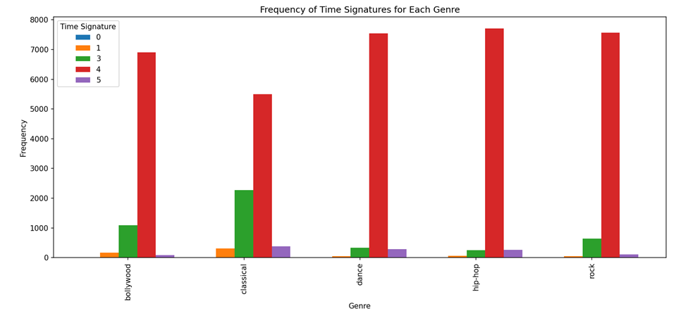

# Song Genre Prediction
### Introduction

The objective of this project is to predict the genre of songs using machine learning and deep learning techniques applied to a dataset collected from the <b>Spotify Web API</b>. The dataset comprises over <b>40,000 songs</b> with various audio features provided by Spotify, such as tempo, danceability, energy, etc. Predicting the genre of a song based on its audio features can be valuable for music recommendation systems and understanding music preferences.
(NOTE: This is<b> NOT</b> a commercial application)

### Techniques/Libraries Used

<li> <b>Spotipy</b> : Python library, allowing seamless integration with the Spotify Web API.
<li> <b>TensorFlow</b> : For building an Artificial Neural Network trained on the dataset.
<li> <b>Scikit-Learn</b> : For implementing ML algorithms such as Random Forest, K Nearest Neighbors, Decision Trees on the dataset.
<li> <b>Pandas/Matplotlib/Seaborn</b> : Python Libraries for Data Analysis and processing.

### Data Collection and Compilation
A dataset of more than 40,000 songs from 5 major genres that are popular in India, namely <b>Hip-hop/Pop, Rock/Meta, Classical/Acoustic, Dance/EDM</b> and <b>Indian/Bollywood</b> has been compiled (About 8000 songs per genre). This dataset contains audio features such as <b>danceability, energy, key
loudness, mode, speechiness, acousticness, instrumentalness, liveness, valence, tempo, duration(in milliseconds), time signature</b> and the <b>genre</b> of each song.

### Exploratory data analysis

Data from the dataset has been analyzed thoroughly. Some key observations that are noted are:
* There are some features that are constant throughout the genres. For Example, Key, which denotes the note that the song is centred around. There is no relation of the key the artist chooses with the genre. This is observed in the plots demonstrated below.
* Similarly, the mode (Major or Minor) and the Time Signature (The number of beats in one measure). All of the genres show a similar trend in the distribution of songs across the two modes (Major being the dominant mode), as well as Time Signatures (4 being the most frequent). Thus, it makes sense to reject these three features for inclusion in the training process.
     

  
  
  

* Observing other features such as danceability, acousticness etc., we observe expected trends such as:
				* Dance/EDM and Hip-Hop genres have the highest danceability, whereas Classical/Acoustic genres have the lowest.
				* On the contrary, Classical genres have the highest acousticness, and Dance genres have the lowest.
				* Hip-Hop genres have the highest value of speechiness, owing  to the inclusion of Rap Songs.
    

  
  
  

* The correlation matrix of various features shows that loudness is highly positively correlated with energy, and highly negatively correlated with acousticness. Thus, it is safe to reject loudness for further analysis.
  

  

*  Finally, Liveness also shows a constant behaviour across all genres. This is clearly explained by the fact that there is no effect on the genre of the song, if it is performed live, or recorded. Thus, we reject this feature.
  

  

* Hence, we finally conclude that danceability, energy, speechiness, acousticness, instrumentalness, valence, tempo, duration_ms are the trainable features for this dataset.

### 

