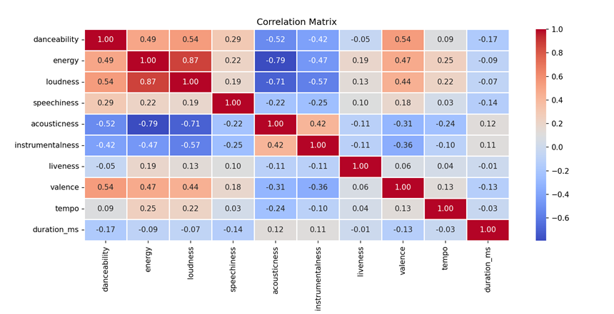

# Song Genre Prediction
### Introduction

The objective of this project is to predict the genre of songs using machine learning and deep learning techniques applied to a dataset collected from the <b>Spotify Web API</b>. The dataset comprises over <b>40,000 songs</b> with various audio features provided by Spotify, such as tempo, danceability, energy, etc. Predicting the genre of a song based on its audio features can be valuable for music recommendation systems and understanding music preferences.
(NOTE: This is<b> NOT</b> a commercial application)

### Techniques/Libraries Used

<li> <b>Spotipy</b> : Python library, allowing seamless integration with the Spotify Web API.
<li> <b>TensorFlow</b> : For building an Artificial Neural Network trained on the dataset.
<li> <b>Scikit-Learn</b> : For implementing ML algorithms such as Random Forest, K Nearest Neighbors, Decision Trees on the dataset.
<li> <b>Pandas/Matplotlib/Seaborn</b> : Python Libraries for Data Analysis and processing.

### Data Collection and Compilation
A dataset of more than 40,000 songs from 5 major genres that are popular in India, namely <b>Hip-Hop/Pop, Rock/Metal, Classical/Acoustic, Dance/EDM</b> and <b>Indian/Bollywood</b> has been compiled (About 8000 songs per genre). This dataset contains audio features such as <b>danceability, energy, key
loudness, mode, speechiness, acousticness, instrumentalness, liveness, valence, tempo, duration(in milliseconds), time signature</b> and the <b>genre</b> of each song.

### Exploratory data analysis

Data from the dataset has been analyzed thoroughly. Some key observations that are noted are:
* There are some features that are constant throughout the genres. For Example, Key, which denotes the note that the song is centred around. There is no relation of the key the artist chooses with the genre. This is observed in the plots demonstrated below.
* Similarly, the mode (Major or Minor) and the Time Signature (The number of beats in one measure). All of the genres show a similar trend in the distribution of songs across the two modes (Major being the dominant mode), as well as Time Signatures (4 being the most frequent). Thus, it makes sense to reject these three features for inclusion in the training process.
     

  
  
  

* Observing other features such as danceability, acousticness etc., we observe expected trends such as:
				* Dance/EDM and Hip-Hop genres have the highest danceability, whereas Classical/Acoustic genres have the lowest.
				* On the contrary, Classical genres have the highest acousticness, and Dance genres have the lowest.
				* Hip-Hop genres have the highest value of speechiness, owing  to the inclusion of Rap Songs.
    

  
  
  

* The correlation matrix of various features shows that loudness is highly positively correlated with energy, and highly negatively correlated with acousticness. Thus, it is safe to reject loudness for further analysis.
  

  

*  Finally, Liveness also shows a constant behaviour across all genres. This is clearly explained by the fact that there is no effect on the genre of the song, if it is performed live, or recorded. Thus, we reject this feature.
  

  

* Hence, we conclude that danceability, energy, speechiness, acousticness, instrumentalness, valence, tempo and duration (in milliseconds) are the trainable features for this dataset.

### Implementation of Machine Learning/Deep Learning
Based on the dataset, and the features that we have extracted, we try to incorporate various ML/DL methods, to predict the genre of a song. The methods that are used are:
* <b>Decision Tree Classifier</b> : With the hyperparamters as- Criterion = Entropy, Maximum Depth = 60, Minimum Samples per Split = 20 and Minimum Samples per Leaf = 60
* <b>K Nearest Neighbour Classifier</b>: With the Number of Neighbours parameter set to 22
* <b>Random Forest Classifier</b> : With the hyperparamters as- Minimum Samples per Leaf = 2, Number of Trees(n_estimate) = 149
* <b>Aritifical Neural Network</b> : Implemented using TensorFlow, with 2 Hidden Layers, having 216 and 128 neurons respectively. The output layer has Softmax activation function. Adam optimizer is used with a learning rate of 0.001.

### Results
For Decision Tree Classifier : Overall F1 Score : **0.66**			
| Genre/ Metric    | Precision | Recall | F1-Score |
| -----------------| --------- |--------|----------|
| Indian/Bollywood  | 0.64     | 0.64   |  0.64    |
| Classical/Acoustic | 0.88    | 0.94   | 0.91	   |
| Dance/EDM | 0.53 	| 0.43| 0.48 	|          |
| Hip-Hop/Pop | 0.63 | 0.69 | 0.66 | 
| Rock/Metal    | 0.59  | 0.59  |0.59|

For K Nearest Neighbours Classifier : Overall F1 Score : **0.69**
| Genre/ Metric    | Precision | Recall | F1-Score |
| -----------------| --------- |--------|----------|
| Indian/Bollywood  | 0.64     | 0.69   |  0.67    |
| Classical/Acoustic | 0.87    | 0.95   | 0.91	   |
| Dance/EDM | 0.56 	| 0.49 | 0.48 	|  0.52	   |
| Hip-Hop/Pop | 0.69 | 0.71      |  0.70	   | 
| Rock/Metal    | 0.64  | 0.57  |0.60|

For K Nearest Neighbours Classifier : Overall F1 Score : **0.72**
| Genre/ Metric    | Precision | Recall | F1-Score |
| -----------------| --------- |--------|----------|
| Indian/Bollywood  | 0.72     | 0.70   |  0.71    |
| Classical/Acoustic | 0.90    | 0.96   | 0.93	   |
| Dance/EDM | 0.63 	 | 0.50 	|  0.55	   |
| Hip-Hop/Pop | 0.69 | 0.78      |  0.73	   | 
| Rock/Metal    | 0.64  | 0.67  |0.65| 

For Artificial Neural Network : Overall F1 Score : **0.71**
| Genre/ Metric      | Precision | Recall | F1-Score |
| -------------------|-----------|--------|----------|
| Indian/Bollywood   | 0.70      | 0.68   |  0.69    |
| Classical/Acoustic | 0.92      | 0.95   | 0.93     |
| Dance/EDM 	     | 0.62      | 0.42   |  0.50    |
| Hip-Hop/Pop 	     | 0.65      | 0.81   |  0.72    | 
| Rock/Metal         | 0.62      | 0.67   |0.64	     |

### Conclusion
* We observe that the Random Forest Classifier has the best overall accuracy (only slightly better than the Artificial Neural Network).
* The Classical/Acoustic genres are more easily predicted while the dance genres are the most difficult to predict, probably because of similarities with other genres.
* It is rather difficult to improve the accuracy beyond this point, probably because of the similarities in two genres in terms of features, for example, Hip-Hop and Dance genres are similar in terms of danceability.

### Usage
* The code is available for testing .
* Run `pip install -r requirememts.txt` to install the necessary libraries
* Run `eda.py` to reproduce EDA results.
* Run corresponding files in `training` folder to train the dataset over different methods.
* Run files in the `prediction` folder to reproduce prediction results. 

### Bonus

I have also developed a Web-App using Django and React, where the users can answer simple questions and get a genre predicted according to their taste.

